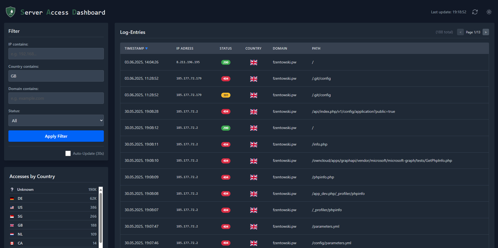

<div align="center">
  
  <h1>Server Access Dashboard (S-A-D)</h1>
  <p>
    A modern, containerized dashboard for visualizing and analyzing Nginx Proxy Manager access logs with GeoIP country detection.
  </p>
  <p>
    <a href="https://github.com/flitschi7/server-access-dashboard/actions/workflows/docker-publish.yml"></a>
    
  </p>
</div>

---

## 🌟 Overview

The Server Access Dashboard (S-A-D) is a full-stack web application designed to process and display the often-cluttered access logs from Nginx Proxy Manager in a user-friendly interface. It collects log entries, enriches them with geo-information, and provides interactive filtering and sorting capabilities for easy analysis of server traffic.

## ✨ Features

- **Automated Log Collection:** Periodically processes `.log` and rotated `.gz` files from Nginx Proxy Manager.
- **GeoIP Enrichment:** Determines the country of origin for each IP address and displays the corresponding flag.
- **Interactive Dashboard:** A paginated and sortable table view of all access logs.
- **Powerful Filtering:** Filter logs by IP address, country, domain, or HTTP status code.
- **Visual Summary:** A summary view shows the top-accessing countries at a glance.
- **Modern Frontend:** A responsive single-page application built with Vue.js and styled with Tailwind CSS.
- **Robust Backend:** A high-performance API powered by FastAPI and SQLAlchemy.
- **Simple Deployment:** Fully containerized and configured with a `docker-compose` file for a quick start.

## 📸 Screenshot

_A screenshot of the dashboard in action._


## 🛠️ Tech Stack

| Area           | Technology                                       |
| :------------- | :----------------------------------------------- |
| **Backend**    | Python, FastAPI, SQLAlchemy, GeoIP2, APScheduler |
| **Frontend**   | Vue.js, Tailwind CSS, Axios                      |
| **Database**   | SQLite                                           |
| **Deployment** | Docker, Docker Compose                           |

## 🚀 Getting Started

Follow these steps to get the dashboard running on your server.

### Prerequisites

- Docker and Docker Compose must be installed on your system.
- You need the path to the `logs` directory of your Nginx Proxy Manager instance.

### Installation

1.  **Copy the `docker-compose-sad.yml` file:**
    Or create a file named `docker-compose.yml` and paste the following content into it:

    ```yaml
    services:
      sad-backend:
        image: ghcr.io/flitschi7/server-access-dashboard/sad-backend:latest
        container_name: sad-backend
        restart: unless-stopped
        volumes:
          - /FOLDER_TO_NGINXPROXYMANAGER/nginxproxymanager/data/logs:/nginx_logs:ro
          - /APP_FOLDER:/app/database
        ports:
          - 8000:8000
        environment:
          - DATABASE_URL=sqlite:////app/database/logs.db
          - LOG_DIRECTORY=/nginx_logs
          - API_KEY=YOUR_API_KEY
          - GEOIP_DATABASE_PATH=/app/database/GeoLite2-Country.mmdb
          - MAXMIND_LICENSE_KEY=YOUR_MAXMIND_LICENSE_KEY
          - LOG_COLLECTION_INTERVAL_MINUTES=${LOG_COLLECTION_INTERVAL_MINUTES:-90} # Default to 90 minutes

      sad-frontend:
        image: ghcr.io/flitschi7/server-access-dashboard/sad-frontend:latest
        container_name: sad-frontend
        restart: unless-stopped
        ports:
          - 5577:80
        environment:
          - API_URL=YOUR_API_URL
          - API_KEY=YOUR_API_KEY
        depends_on:
          - sad-backend
    ```

2.  **Configuration**

    Before starting the containers, you need to configure the environment variables in your `docker-compose.yml` file.

    - **`API_KEY`**: Set a secure, random string for both the `sad-backend` and `sad-frontend` services. This key protects your API from unauthorized access. The value must be identical for both services.
    - **`API_URL`**: In the `sad-frontend` service, set this to the external URL of your backend, e.g., `http://YOUR_SERVER_IP:8000`.
    - **`MAXMIND_LICENSE_KEY`**: This is a **mandatory** free license key from MaxMind, which is required to download the GeoIP database for country lookups.

    **How to get your MaxMind License Key:**

    1.  Sign up for a free GeoLite2 account on the [MaxMind website](https://www.maxmind.com/en/geolite2/signup).
    2.  After signing up and logging in, navigate to "Manage License Keys" in the left-hand menu.
    3.  Click "Generate new license key" and give it a descriptive name (e.g., "sad-dashboard").
    4.  Copy the generated key and paste it as the value for `MAXMIND_LICENSE_KEY` in your `docker-compose.yml`.

3.  **Start the application:**
    Run the following command in the same directory where you saved your `docker-compose.yml` file:

    ```bash
    docker-compose up -d
    ```

4.  **Access the Dashboard:**
    The application is now accessible at `http://YOUR_SERVER_IP:5577`. After the first start, it may take a few minutes for the initial log entries to be processed and become visible.

## 📄 License

This project is licensed under the MIT License.
